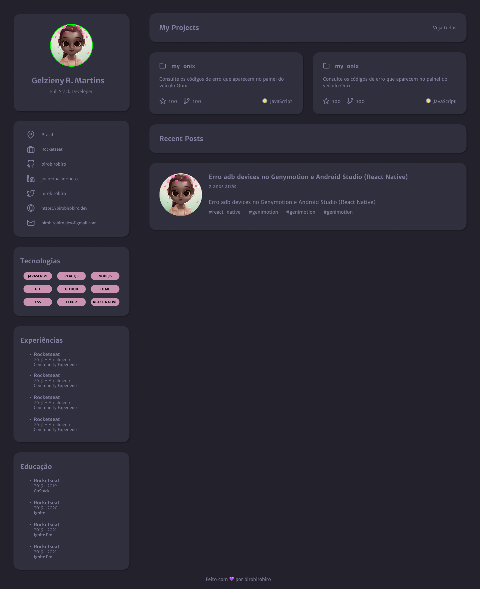

# 💼 Portfólio • Desafio Discover - Rocketseat Community

Este projeto é uma página de portfólio desenvolvida como parte do **Desafio Discover - Community** da Rocketseat. A proposta foi transformar o layout disponível no Figma em uma página web funcional, utilizando tecnologias modernas como **Vite.js**, **React**, **TypeScript** e **Tailwind CSS**.

---

## ✨ Funcionalidades

- Página de apresentação pessoal
- Lista de projetos com links clicáveis
- Informações de contato e redes sociais
- Design responsivo para diferentes tamanhos de tela
- Alternância de tema (modo claro/escuro) *(opcional, se implementado)*

---

## 📸 Preview do Projeto




---

## 🛠 Tecnologias Utilizadas

- [React](https://react.dev/)
- [TypeScript](https://www.typescriptlang.org/)
- [Vite](https://vitejs.dev/)
- [Tailwind CSS](https://tailwindcss.com/) v4
- [Lucide React](https://lucide.dev/)

---

## 📄 Instruções do Desafio

Confira os detalhes completos do desafio:  
🔗 [Acessar desafio no Notion](https://efficient-sloth-d85.notion.site/Desafio-Portfolio-1d3db21e654941f5872aece5fcc6bcc6)

---

## 🎨 Layout

O design original pode ser visualizado no Figma:  
🔗 [Acessar layout no Figma](https://www.figma.com/design/l5zKjaRxYJ23tU3j3HQzX2/Portfolio-%E2%80%A2-Desafio-Discover--Community---Copy-?node-id=0-1&p=f&t=EZfA54y3O5ezH2Ve-0)

---

## 📂 Estrutura do Projeto

```
📁 portfolio-vite/
├── 📁 public/
│ └── favicon.svg
├── 📁 src/
│ ├── 📁 assets/
│ ├── 📄 main.js
│ └── 📄 style.css
├── 📄 index.html
├── 📄 package.json
├── 📄 vite.config.js
└── 📄 README.md
``` 


---

## 🚀 Como Executar o Projeto

### ✅ Pré-requisitos

Você precisará ter instalado em sua máquina:

<a href="https://skillicons.dev">
  
</a>

---

### 📥 Clone o repositório


```bash
# Clone este repositório
$ git clone <https://github.com/Gelzieny/nlw-in-orbit.git>

# Acesse a pasta do projeto no terminal/cmd
$ cd nlw-in-orbit.git


# Instale as dependências
$ npm install

# Execute a aplicação em modo de desenvolvimento
$ npm run dev

# O servidor inciará na porta:3334 - acesse <http://localhost:5173/>
```

# 🧑🏻‍💻 Autor

Feito com ❤️ por Gelzieny R. Martins 👋🏽 [Entre em contato!](https://www.linkedin.com/in/gelzieny-r-martins-180551106/)

## 📝 Licença

Este projeto esta sobe a licença [MIT](./LICENSE).